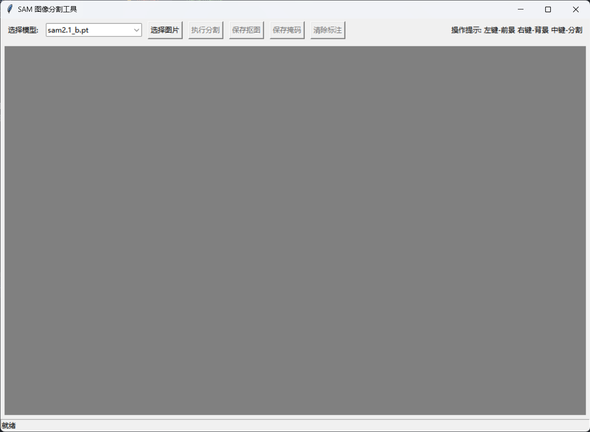

# SAM Segmentation Tool

This is a user-friendly image segmentation tool built with Python, leveraging the Segment Anything Model (SAM2) from Ultralytics. The tool provides an intuitive graphical interface for interactive image segmentation, allowing users to define foreground and background regions with simple clicks.

## Installation
### Prerequisites

- Python 3.8 or higher
- pip (Python package installer)

### Required Packages

- tkinter(for GUI)
- ultralytics(for SAM2 implementation)

# Using

## Download models

From [here](https://docs.ultralytics.com/zh/models/sam-2/#how-to-use-sam-2-versatility-in-image-and-video-segmentation) to download sam models, default sam2.1_b.pt

## Try it

As shown in the figure, it is obvious for using.

